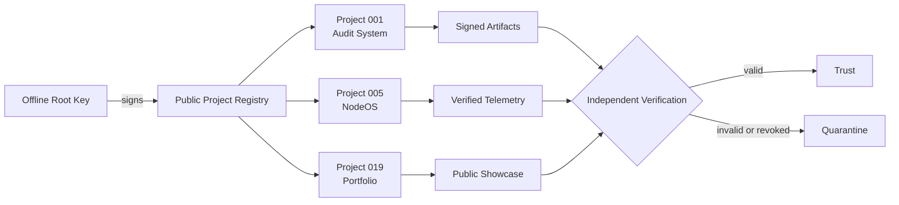
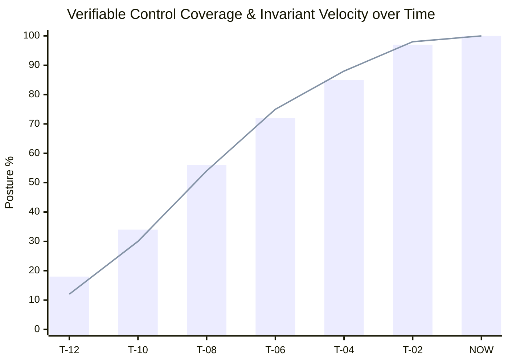

<div align="center">
  
  <h1>SafeStack</h1>
  <p><strong>Verifiable security systems for teams that cannot afford silent failure.</strong></p>
  <p>
    <a href="https://safestack.engineering">Official Showcase</a> ·
    <a href="https://github.com/kibernetinio-saugumo-sprendimai/safestack-repo-map">Repository Map</a> ·
    <a href="https://github.com/kibernetinio-saugumo-sprendimai/safestack-project-public-keys">Public Key Registry</a> ·
    <a href="https://github.com/kibernetinio-saugumo-sprendimai/safestack-validation-registry">Validation Registry</a> ·
    <a href="https://github.com/kibernetinio-saugumo-sprendimai/.github/blob/main/SECURITY.md">Security Policy</a>
  </p>
</div>

---

SafeStack builds security infrastructure around a strict standard: critical actions must be bounded, attributable, isolated by default, and independently verifiable. We engineer deterministic security controls across runtime kernels, audit automation, zero-trust edge infrastructure, and cryptographic canons.

## Operating Model & Key Isolation



The offline root key signs the public project key registry. Every project maintains its own isolated Ed25519 signing key. Revocation of any single project key immediately isolates the blast radius without invalidating the broader ecosystem.

## Control Signals & Integrity Metrics



| Control Signal | Verified State |
| --- | ---: |
| Verified public repositories | **22** |
| Project signing algorithm | **Ed25519** |
| Public repositories containing private keys | **0** |
| Private repositories exposed | **0** |
| Private key file mode on managed workstations | **0600** |
| Default trust posture | **Fail-Closed** |

## Architectural Layers & Public Repositories

### 1. Trust & Registry Core
- [safestack-canon](https://github.com/kibernetinio-saugumo-sprendimai/safestack-canon) — Canonical integrity anchors and signed foundational trust principles.
- [safestack-technical-canon](https://github.com/kibernetinio-saugumo-sprendimai/safestack-technical-canon) — Technical canon specifications, manifest schemas, and cryptographic governance.
- [safestack-project-public-keys](https://github.com/kibernetinio-saugumo-sprendimai/safestack-project-public-keys) — Signed public Ed25519 keys for projects and release signers.
- [safestack-validation-registry](https://github.com/kibernetinio-saugumo-sprendimai/safestack-validation-registry) — Official authoritative ledger of validated projects, audit records, and declarations.
- [Verification-artifacts](https://github.com/kibernetinio-saugumo-sprendimai/Verification-artifacts) — Detached cryptographic checksum files, verification manifests, and audit scripts.
- [safestack-control-architecture](https://github.com/kibernetinio-saugumo-sprendimai/safestack-control-architecture) — Layered routing, cryptographic trust boundaries, and control planes.

### 2. Runtime & Infrastructure
- [node-os](https://github.com/kibernetinio-saugumo-sprendimai/node-os) — Autonomous zero-trust operating layer for edge nodes with NVMe SMART health monitoring.
- [Safestack-Zero-Trust](https://github.com/kibernetinio-saugumo-sprendimai/Safestack-Zero-Trust) — Local-first zero-trust policy decision engine, default-deny enforcement, and posture gates.
- [SafeStack-Zero-Trust-Platform](https://github.com/kibernetinio-saugumo-sprendimai/SafeStack-Zero-Trust-Platform) — Zero-trust security platform and policy orchestration components.
- [Safestack-Sentinel](https://github.com/kibernetinio-saugumo-sprendimai/Safestack-Sentinel) — Continuous telemetry monitoring daemon and host anomaly detection.
- [Safestack-suite](https://github.com/kibernetinio-saugumo-sprendimai/Safestack-suite) — Integrated runtime utilities and cryptographic CLI tools.

### 3. Intelligence & Automation
- [safestack-audit_system](https://github.com/kibernetinio-saugumo-sprendimai/safestack-audit_system) — Deterministic AI-assisted security audit framework with hardened runtime governance.
- [safestack-OSINT](https://github.com/kibernetinio-saugumo-sprendimai/safestack-OSINT) — Modular, policy-driven OSINT framework with cryptographic integrity verification.
- [AI-Tyreju-Komanda](https://github.com/kibernetinio-saugumo-sprendimai/AI-Tyreju-Komanda) — AI investigative agent tooling and collaborative analysis workspace.

### 4. Web & Publishing
- [freedom.manifesto.github.io](https://github.com/kibernetinio-saugumo-sprendimai/freedom.manifesto.github.io) — Public SafeStack freedom manifesto portal and community documentation.
- [safestack-porfolio.github.io](https://github.com/kibernetinio-saugumo-sprendimai/safestack-porfolio.github.io) — Official public portfolio, systems showcase, and live telemetry ([safestack.engineering](https://safestack.engineering)).
- [safestack-book](https://github.com/kibernetinio-saugumo-sprendimai/safestack-book) — SafeStack library for architectural books, technical papers, and NIST FIPS standards.
- [.github](https://github.com/kibernetinio-saugumo-sprendimai/.github) — Global organisation profiles, community health standards, and workflow defaults.

### 5. Ecosystem & Meta
- [safestack-repo-map](https://github.com/kibernetinio-saugumo-sprendimai/safestack-repo-map) — Interactive visual tree and architectural map of the organization.
- [safestack-partners](https://github.com/kibernetinio-saugumo-sprendimai/safestack-partners) — Security ecosystem integration resources and partner guidelines.
- [safestack-media-library](https://github.com/kibernetinio-saugumo-sprendimai/safestack-media-library) — Curated visual asset library for schematics, diagrams, and vector assets.
- [safestack-music](https://github.com/kibernetinio-saugumo-sprendimai/safestack-music) — Public SafeStack soundtrack and audio link catalogue.

## Verification First

The public registry is not trusted merely because it is published. Verify the root signature and project keys locally:

```bash
python3 key_registry.py verify --registry public-project-keys.json
```

All private root and project keys remain offline and are never stored in public repositories. Consult the [registry certificate](https://github.com/kibernetinio-saugumo-sprendimai/safestack-project-public-keys/blob/master/SAFESTACK_PROJECT_PUBLIC_KEYS_CERTIFICATE.md) for current cryptographic fingerprints.

## Foundational Principles

- **Evidence over claims:** Security controls must produce deterministic, inspectable evidence.
- **Isolation by default:** Failures, credentials, and modules are strictly quarantined to their bounded blast radius.
- **Fail closed:** If a system cannot verify a state or signature, it must refuse to operate.
- **Human review at the boundary:** Automation collects telemetry and drafts audits; human operators decide authoritative state.

<div align="center">
  <sub>SafeStack · Independent security research and systems engineering</sub>
</div>
