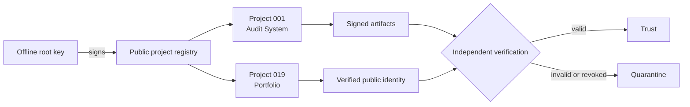
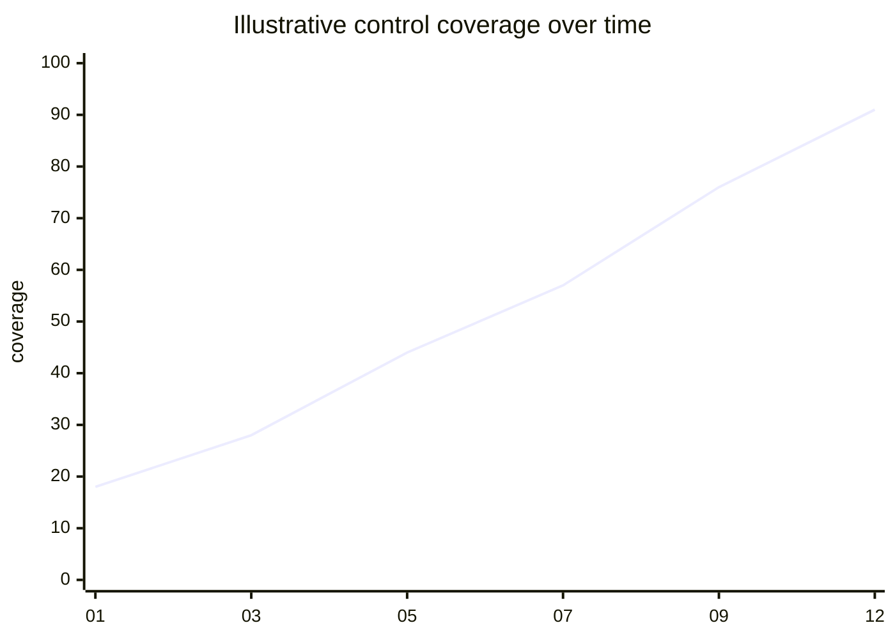

<div align="center">
  
  <h1>SafeStack</h1>
  <p><strong>Verifiable security systems for teams that cannot afford silent failure.</strong></p>
  <p>
    <a href="https://github.com/kibernetinio-saugumo-sprendimai/safestack-project-public-keys">Public key registry</a> ·
    <a href="https://github.com/kibernetinio-saugumo-sprendimai/safestack-audit_system">Audit system</a> ·
    <a href="https://github.com/kibernetinio-saugumo-sprendimai/.github/blob/main/SECURITY.md">Security policy</a>
  </p>
</div>

---

SafeStack builds security infrastructure around a simple standard: critical actions should be bounded, attributable and independently verifiable. We work across audit automation, project identity, OSINT and zero-trust architecture.

## What we build

| Capability | Outcome |
| --- | --- |
| **Security audits** | Source-aware analysis with bounded inputs, explicit failure states and reviewable evidence. |
| **Project identity** | One Ed25519 signing key per project, a root-signed public registry and scoped revocation. |
| **Trust architecture** | Clear boundaries between operators, systems, artifacts and the authority that verifies them. |
| **Security intelligence** | Structured OSINT and control signals that help teams make decisions with evidence. |

## Operating model



The root key is kept offline. Project keys are isolated from one another, and a compromised project key can be revoked without invalidating the rest of the portfolio.

## Control signals

The chart below is an illustrative control-coverage view. It is a design signal, not a claim about production telemetry.



| Signal | Current state |
| --- | ---: |
| Projects in signed public registry | **18** |
| Project signing algorithm | **Ed25519** |
| Public repositories containing private keys | **0** |
| Private key file mode on managed workstation | **0600** |

## Selected projects

- [SafeStack Audit System](https://github.com/kibernetinio-saugumo-sprendimai/safestack-audit_system) — bounded, fail-closed audit workflow.
- [SafeStack Sentinel](https://github.com/kibernetinio-saugumo-sprendimai/Safestack-Sentinel) — monitoring and response experiments.
- [SafeStack OSINT](https://github.com/kibernetinio-saugumo-sprendimai/safestack-OSINT) — security intelligence research.
- [Zero Trust Platform](https://github.com/kibernetinio-saugumo-sprendimai/SafeStack-Zero-Trust-Platform) — trust-boundary architecture.
- [Project public-key registry](https://github.com/kibernetinio-saugumo-sprendimai/safestack-project-public-keys) — signed project identities and fingerprints.

## Verification first

The public registry is not trusted merely because it is published. Verify its root signature before trusting a project key:

```bash
python3 key_registry.py verify --registry public-project-keys.json
```

Private root and project keys remain offline and are never stored in this organization profile or public repositories. Read the [registry certificate](https://github.com/kibernetinio-saugumo-sprendimai/safestack-project-public-keys/blob/master/SAFESTACK_PROJECT_PUBLIC_KEYS_CERTIFICATE.md) for the current signed inventory.

## Partner resource

See the [SafeStack partner directory](https://github.com/kibernetinio-saugumo-sprendimai/safestack-partners) for the full list and purpose of our security ecosystem resources.

<a href="https://threatmap.xcitium.com/" target="_blank" rel="noreferrer"><strong>Xcitium ThreatMap</strong></a> — real-time malware threat intelligence and a useful external signal for the wider security community.

## Principles

**Evidence over claims.** Controls should produce something another person can inspect.

**Isolation by default.** A project, credential or failure should have the smallest practical blast radius.

**Fail closed.** If a system cannot verify a state, it must not report that state as trusted.

**Human review at the boundary.** Automation can prepare evidence and drafts; operators decide what becomes authoritative.

<div align="center">
  <sub>SafeStack · independent security research and systems engineering</sub>
</div>
